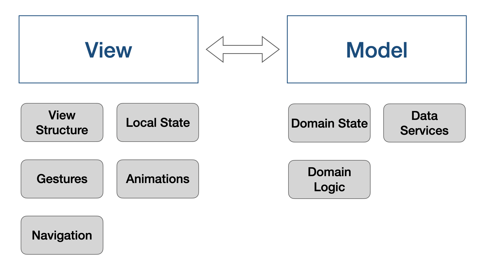

_Background image by [Dan Roizer](https://unsplash.com/@danroizer) under the [Unsplash license](https://unsplash.com/license)_

SwiftUI, introduced by Apple in 2019, allows developers to create apps with declarative UI programming and state management, which greatly helps to improve development speed and quality. However, the framework is locked at the iOS 13 SDK, and every new improvement iteration to this new framework will push up this restriction to the latest SDK (iOS 14, and so on).

AltSwiftUI is an open source UI framework for iOS that mimics SwiftUI’s interface, introducing a single OS baseline at iOS 11 and greater flexibility because of its open source nature.

Starting to use AltSwiftUI is pretty straightforward, just import it through Cocoa pods or Swift Package Manager. If you are familiar with SwiftUI syntax, then you are good to go.

For more info see: https://github.com/rakutentech/AltSwiftUI

## A peak into code

Other than some small differences, the code structure is highly similar to that of regular SwiftUI code. Of the main things we can point out, AltSwiftUI doesn't use associated types in views, meaning that it is not necessary to use opaque return types (`some View`).

## Extended features

AltSwiftUI interface is inspired by SwiftUI, but we needed more features and capabilities than originally offered, so we introduced extra functionalities in AltSwiftUI.

For example, we needed deeper integrations with List and ScrollView interactions, so there are methods like `ScrollView.scrollOffset` and `List.onDragStarted`. There are also multiple small additions to some of the views and modifiers, and this list will keep growing in the future. To identify these features, you can read the source documentation during development or at https://altswiftui.com.

## AltSwiftUI in Rakuten Travel

AltSwiftUI’s development started at the end of 2019, with the main purpose of taking on new projects while renewing the way we design software, improve the speed and quality of our development, and be more futureproof. During this journey, we tackled multiple challenges by comparing what SwiftUI originally offered with what our app needed, and the open source nature of this framework allowed us to improve it by adding features that would allow us to meet our app expectations. 

_Rakuten Travel Premium Club_ is an invitation only app built with AltSwiftUI.

### Simplified Architecture

One of the pillars that gave us a strong advantage in terms of design and development, is the ability to simplify our app’s architecture. In contrast to using design patterns such as MVVM or VIPER, which usually tend to increase the number of things a developer needs to worry about, we could transition to a MV (model view) design with AltSwiftUI at its core. 

The core principle of this MV design is that developers should focus more on what they want to build, rather than how. By clearly delimiting what is part of the UI (view layer) and what is part of our business logic/data (model layer), we were able to also easily visualize our tasks and improve development efficiency.

The view layer consists of components that interact with the user. This includes the actual view structure, its local state, navigation, gestures, animations, and so on. We define all of this in a single layer by the use of declarative programming.

The model layer consists of operations that retrieve, process and store data that are part of our business domain. At the same time, it exposes this data to the view layer as transparently as possible for a simple and smooth integration.

The framework’s ability to integrate view state with data, including automatic updates, is what allows us to remove intermediate layers of complexity that often cause bugs. Instead, the framework handles these intermediate layers without any extra code.

---

These are the pros and cons of using this approach that we observed in our development team:

__Pros__

- Our development speed is much faster.
- We can more easily improve our app visuals and interactions.
- We don't need to worry about OS deployment versions when adding features.
- We can more easily request UI improvements to other developers during peer review due to reduced cost.
- We can prototype and add original features more quickly.

__Cons__

- We need to maintain AltSwiftUI on top of our regular tasks, which demands more effort from our part.
- Our developers need to learn the combined features of SwiftUI and AltSwiftUI.

It’s hard to tell what will happen in some years from now. By working with the same design philosophy that accompanies the emerging SwiftUI framework and also an extremely similar code structure, we improve our chances for any future transition to be less costly and smoother.

## AltSwiftUI’s future

Following the project’s roadmap, our goal is for the framework to get new components as they are released in SwiftUI, as well as keep getting new extra features for better quality of life. At the same time, we would like this framework to serve as a transition bridge for projects that plan to use SwiftUI in the future.